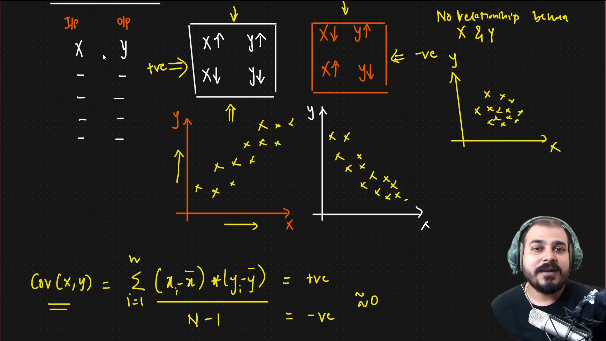

### PCA in Dimentionality Reduction

* **Curse of Dimentionality**

  * Sometimes we train our models with lots of features that dont impact much. and our model will get confuse.
* **Dimentionality Reduction**

  * Dimensionality reduction is a broader concept that involves reducing the number of features (or dimensions) in a dataset while preserving as much relevant information as possible. It can be achieved through various techniques, including **feature extraction** and **feature selection**.
* **Why Dimenti onality Reduction**

  1. To prevent curse of dimentionality
  2. To improv  e the performance of the model
  3. To visualize the data and understand the data
* **2 ways to achieve dimentionality reduction**

  1. **Feature Selection**
     * Feature selection means **choosing a subset of the original features** (without modifying them) that are most relevant for the model.
     * Feature Selection Techniques
       1. Calculate relaction through **Co-varience**
          * if cov(x,y) is +ve or -ve, it means relation between x and y is strong, in that case we can't remove this specific feature because x is important to predict y.
          * if cov(x,y) is ~0 (close to 0) it means no relation between x and y, so in that case I can remove the specific feature(x) also.
          * another way is ->  Pearson Correlation: $r_{xy} = \frac{Cov(X, Y)}{\sigma_X \cdot \sigma_Y}$
            * **C**o**v**(**X**,**Y**) = covariance between x and y
            * σx = standard deviation of x
            * σy = standard deviation of y
            * the more toward the value of +1 the more positive co-related x & y is, it means relation between x and y is strong
            * the more toward the value of -1 the more negatively co-related x & y is, it means relation between x and y is strong
            * the more toward the value of 0 the less co-related x & y is, it means relation between x and y is weak, so I can drop the fuature x.
          * 
  2. **Feature Extraction**
     * a subset of dimensionality reduction, specifically refers to transforming the original high-dimensional data into a lower-dimensional space by creating new features that capture the essence of the original data.
     * **PCA(Principal Component Analysis)**

  * **Multicolinirity**

co varience matrix
