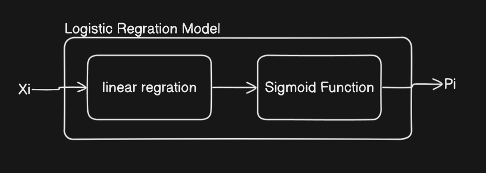
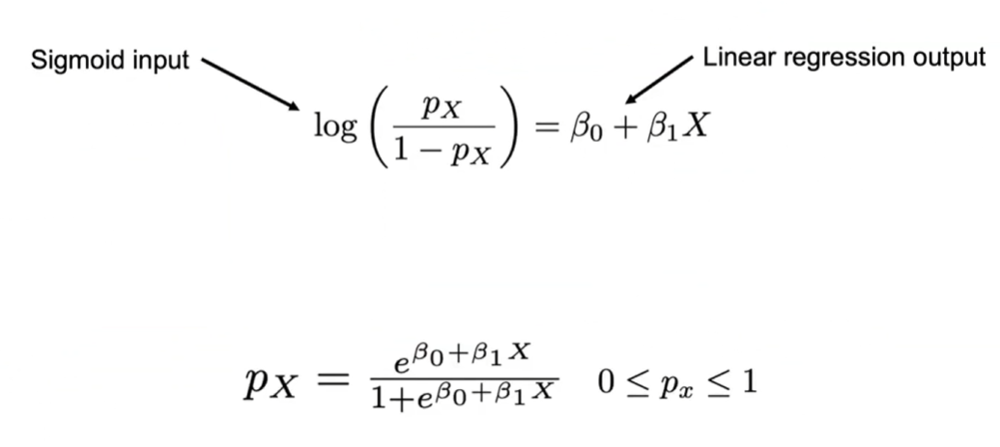
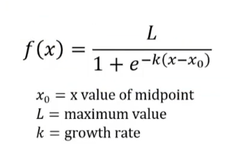
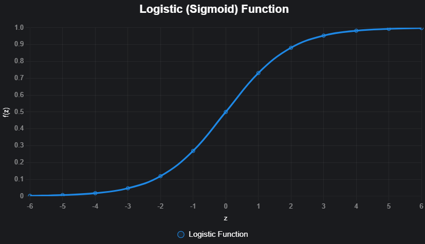

#### Logistic Regression

Logistic regression is a supervised machine learning algorithm used for classification tasks, despite its name suggesting regression. It predicts the probability that a given input belongs to a particular class, making it ideal for binary classification (e.g., yes/no, spam/not spam) and extendable to multi-class classification (e.g., classifying types of flowers).

* It takes numerical values(continous and descrete both) as an input.
* Gives output in term of probability which is always in range of (o to 1).
* give descrete numbers(countable outputs) as an output.

 **Use Case Examples** :

* Predicting whether a patient has a disease (e.g., diabetic or not).
* Classifying emails as spam or not spam.
* 

---

* **Label Encoding :** Converting a categorical value into numerical value is know as Label encoding.

  * Like - converting spam or not spam emails into 0 or 1 respectively.

---

* **Logistic(Sigmoit) Function :** It converts any value (in the range of -♾️ to +♾️) into the range of 0 to 1.

  * **Usecase :** we use linear regration in background of logistic regration and linear regration give values in range of -♾️ to +♾️. so, here we need logistic function to convert this values into the range of 0 to 1.
  * The logistic function, also known as the sigmoid function, is defined as:

  $$
  f(z) = \frac{1}{1 + e^{-z}}
  $$

  where:

  - \( z \) is the input (a real number).
  - \( e \) is the base of the natural logarithm (\(\approx 2.718\)).
  - \( f(z) \) is the output, a value between 0 and 1.
  - The linear combination ( z ) in logistic regression is typically calculated as:

  $$
  z = w_1x_1 + w_2x_2 + \dots + w_nx_n + b
  $$

  where:

  - \( x_1, x_2, \...., x_n \): Input features (e.g., age, income).
  - \( w_1, w_2, .....\, w_n \): Weights (coefficients) for each feature, learned during training.
  - \( b \): Bias term (intercept), a constant.
  - \( z \): The resulting linear combination, a real number.
    
    

**Logit**

---

multicolumarity

co-relation
